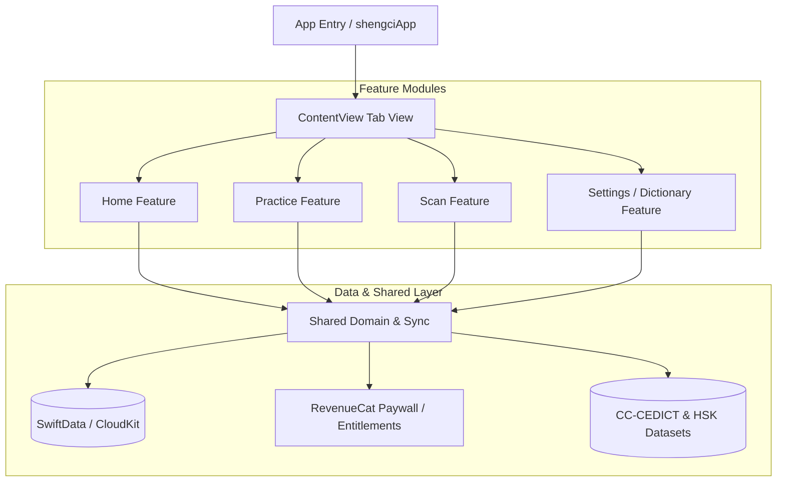

# Shengci (生词) Architecture Reference

This document provides a detailed overview of the system architecture, design patterns, data models, and core feature flows for the **Shengci (生词)** iOS application.

---

## 🛠 Tech Stack & Frameworks

* **Language**: Swift 6
* **UI Framework**: SwiftUI
* **Persistence & Synchronization**: SwiftData + CloudKit (`iCloud.com.dwiki.shengci`)
* **Computer Vision / OCR**: Vision Framework (`VNRecognizeTextRequest`)
* **Monetization & In-App Purchases**: RevenueCat (`Purchases`)
* **Widgets & Extensions**: WidgetKit (Home Screen Widgets, Control Center, Live Activities)
* **Notifications**: UserNotifications framework (Daily Word Notifications)
* **Embedded Resources**: CC-CEDICT (`cedict_ts.u8`) & HSK 1–7 JSON vocabulary datasets

---

## 🏗 Architectural Pattern

Shengci employs a **Feature-Driven Clean Architecture** combined with modern SwiftUI practices (e.g., Swift `@Observable` macro and SwiftData model contexts).



Each feature module is decoupled and adheres to a **Clean Architecture** layering pattern:

* **Presentation Layer**: SwiftUI Views, ViewModels (`@Observable`), custom UI components, and state management.
* **Domain Layer**: Core business logic, value objects, tokenizers, formats, and managers.
* **Data Layer**: Repositories, OCR engines, local file parsers, and persistent database schemas.

---

## 📁 Directory Structure

```
shengci/
├── App/                            # App Initialization & Root Navigation
│   ├── shengciApp.swift            # @main entry point, SwiftData container, CloudKit sync setup
│   ├── ContentView.swift           # Primary TabView navigation container
│   ├── SubscriptionManager.swift   # RevenueCat state wrapper
│   └── CloudKitSchemaInitializer.swift
│
├── Features/                       # Feature-Driven Modules
│   ├── Home/                       # Vocabulary library & dashboard
│   │   ├── Domain/                 # SavedWord models & presentation state logic
│   │   └── Presentation/           # HomeView, WordOverviewGrid, custom scroll scrubbers
│   │
│   ├── Practice/                   # SRS & Quiz system
│   │   ├── Domain/                 # PracticeQuiz, PracticedWord, PracticeSessionRecord
│   │   └── Presentation/           # PracticeView & interactive flashcard/quiz UI
│   │
│   ├── Scan/                       # Camera & Photo OCR for Chinese text
│   │   ├── Data/                   # AppleOCRRecognizer (Vision framework wrapper)
│   │   ├── Domain/                 # ChineseTextSegmenter, Tokenizer, OCR Text Regions
│   │   └── Presentation/           # LiveTextScannerView, PhotoOCRView, ZoomableOCRImageView
│   │
│   ├── Settings/                   # Settings, Dictionary Search, HSK Sessions, Handwriting
│   │   └── Presentation/           # DictionarySearchView, HandwritingCanvasView, HSKLevelSessionsView
│   │
│   └── Shared/                     # Cross-feature domain components
│       ├── Domain/                 # LearningDataSync, DailyWordNotificationManager, PinyinFormatter
│       └── Presentation/           # Shared views & UI modifiers
│
├── Resources/                      # Offline Data Assets
│   ├── cedict_ts.u8                # CC-CEDICT Chinese-English Dictionary database
│   └── hsk1.json ... hsk7.json     # Official HSK vocabulary datasets (Levels 1-7+)
│
└── shengciWidget/                  # WidgetKit Extension Target
    ├── shengciWidget.swift         # Home screen widgets & timelines
    ├── shengciWidgetLiveActivity.swift # Live Activities UI
    └── shengciWidgetControl.swift  # Control Center actions
```

---

## 💾 Data Persistence & Cloud Synchronization

Shengci leverages **SwiftData** backed by a private **CloudKit** database to enable seamless, real-time synchronization across all user devices.

### Primary Data Models

1. **`SavedWord`**
   * Represents a character or phrase saved by the user.
   * Tracks Spaced Repetition System (SRS) metrics: repetition count, interval, ease factor, last review date, next review date.
   * Stores simplified/traditional characters, Pinyin, English definitions, and audio references.

2. **`PracticeSessionRecord`**
   * Stores historical record of completed practice/quiz sessions.
   * Tracks date, score, session duration, mode (Flashcards, Choice, Pinyin, Writing), and target HSK levels.

3. **`LearningSyncState`**
   * Tracks CloudKit synchronization timestamps and mutation tokens to perform background reconciliation via `LearningDataSync`.

---

## 📷 Vision & Chinese Text Processing Pipeline

The **Scan** module implements a high-performance OCR and tokenization engine for Chinese text recognition:

```
[ Camera / Photo ] 
       │
       ▼
[ AppleOCRRecognizer ]  ── (Vision Framework: VNRecognizeTextRequest)
       │
       ▼
[ OCRTextRegion / BoundingBoxes ]
       │
       ▼
[ ChineseTextSegmenter ] ── (Maximal Match Tokenizer + CC-CEDICT Dictionary)
       │
       ▼
[ ScannedToken Selection UI ] ──► [ Instant Word Detail Sheet & Save ]
```

---

## 💳 Monetization & Subscription Architecture

* **RevenueCat Integration**: `SubscriptionManager` encapsulates `Purchases.shared` to track subscription status (Freemium vs. Premium).
* **Entitlement Checks**: Premium features (e.g., unlimited OCR scans, advanced HSK levels, detailed analytics) are gated via `PremiumAccess` helpers.

---

## 🔔 Widget & Background Systems

* **Daily Word Notifications**: Managed by `DailyWordNotificationManager`, scheduling local notifications based on scheduled review items.
* **Widget Extension**: `shengciWidget` shares data containers with the main app group to display daily word cards and SRS progress on the iOS Home Screen and Lock Screen.
